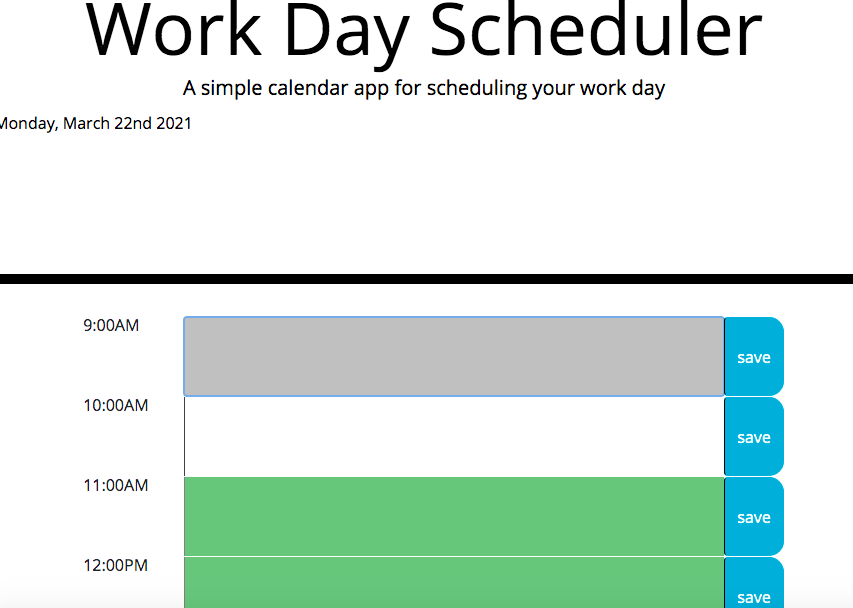

# HW5 workday daily planner
This application is designed to assist an employee with a busy schedule to create a daily planner and manage time effectively.


## This Web Application Meets These Specifications

```md
WHEN the planner is opened
THEN the current day is displayed at the top of the calendar
WHEN the user scrolls down
THEN timeblocks are presented for standard business hours
WHEN the user views the timeblocks
THEN each timeblock is color coded to indicate whether it is in the past, present, or future
WHEN the timeblocks are clicked
THEN the user can enter an event
WHEN the save button is clicked
THEN the text for that event is saved in local storage
WHEN the page is refreshed
THEN the saved events persist
```


##Link to the deployed app
 https://mikeyhauser.github.io/HW5workday/

 
